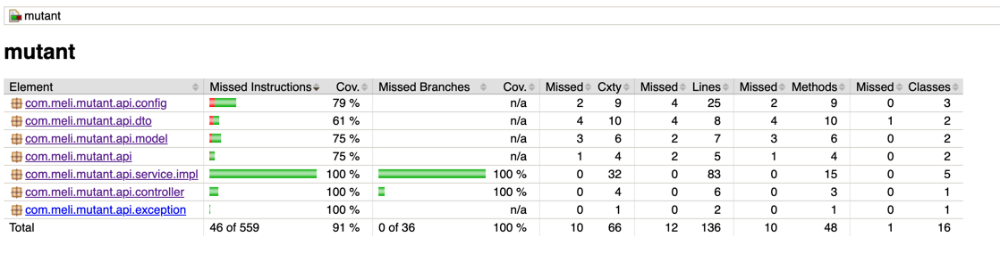

```javascript
/**
 * @autor Cristian Robayo
 * @rol Backend Developer
 **/
```

# Operación Mutante
Proyecto que detecta si un humano es mutante basándose en su secuencia de ADN basado en Java 8 + Spring Boot.
Se recibe como parametro un array de String de NXN con la secuencia de ADN con los siguientes caracteres (A,T,C,G). Un humano es mutante, si se encuentra más de una secuencia de cuatro letras iguales, de forma oblicua, horizontal o vertical.
---
### Prerequisitos
Para la ejecución de la aplicación en ambientes locales se debe tener instalado los siguientes programas:

- [Git]
- [Java 8 SDK]
- [Maven]
- STS, Eclipse o IntelliJ
- Postgres

---
### Instalación
- 1) Se debe descargar el proyecto del repositorio remoto de git

```sh
$ git clone https://github.com/cristianillo/mutant.git
```
- 2) Acceder a la carpeta `mutant`.

```sh
$ cd mutant
```
- 3) Compilar la aplicación con el siguiente comando:

```sh
$ mvn clean install
```
- 4) Correr la aplicación con Spring Boot de manera local.

```sh
$ mvn spring-boot:run
```
---
### Contenido de la aplicación

El utilizó Swagger para la documentación básica de los métodos y el endpoint es el siguiente:
- [http://mutant-env.eba-kadczkdw.us-west-2.elasticbeanstalk.com/swagger-ui.html][endpoint-swagger]

El servicio soporta los siguientes métodos:
##### POST /mutant/
Determina si el arreglo de ADN es mutante o humano.
- EndPoint: http://mutant-env.eba-kadczkdw.us-west-2.elasticbeanstalk.com/mutant/

Request del método:

```json
{
  "dna":[
    "ATGCGA",
    "CAGTGC",
    "TTATGT",
    "AGAAGG",
    "CCCCTA",
    "TCACTG"
  ]
}
```

##### GET /topsecret_split/
Se encarga de contar el numero de humanos y mutantes que se han procesado.

- EndPoint: http://mutant-env.eba-kadczkdw.us-west-2.elasticbeanstalk.com/stats

Respuesta del método:
```json
{
  "count_human_dna": 100,
  "count_mutant_dna": 40,
  "ratio": 0.4
}
```
##### Coverage
Para el reporte de coverage se utilizo Jacoco y este reporte se puede generar con el siguiente comando:

```sh
$ mvn clean package
```

El reporte se puede ver desde el archivo *index.html* que se encuentra en la siguiente carpeta del proyecto *target/site/jacoco/index.html*



[Java 8 SDK]: https://www.oracle.com/co/java/technologies/javase/javase-jdk8-downloads.html
[Maven]: https://maven.apache.org/download.cgi
[Git]: https://git-scm.com/downloads
[endpoint-swagger]: http://mutant-env.eba-kadczkdw.us-west-2.elasticbeanstalk.com/swagger-ui.html

_


